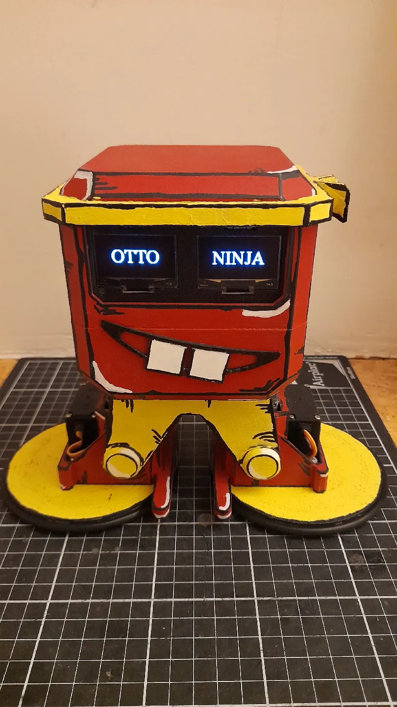
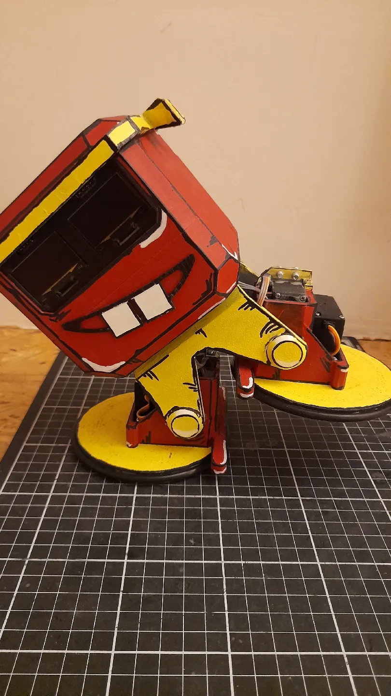
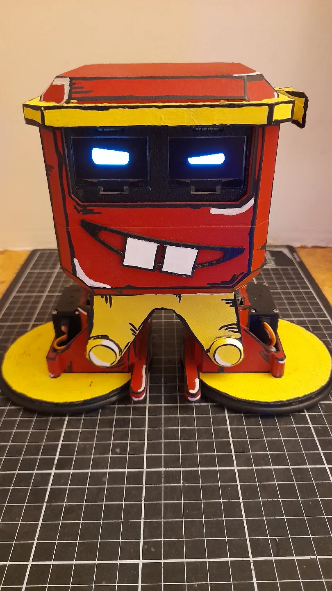
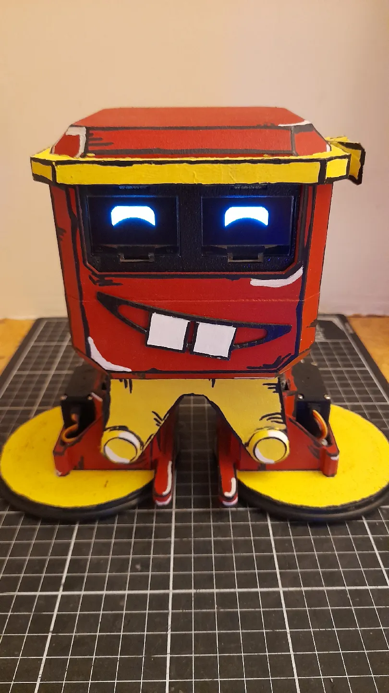

# Otto Ninja XL ESP32 PS4 Robot Controller (Otto Ninja XL Remix)

This is a **remix** of the [original OTTO Ninja DIY robot](https://github.com/OttoDIY/OttoNinja/), enhanced with ESP32 functionality, PS4 controller support, servo-based movements, animated eyes, and sound effects.  
The 3D model is adapted from the [Otto Ninja Starter robot](https://www.printables.com/model/231580-otto-ninja-starter-robot).

## 3D Model
- The robot uses the **Otto Ninja XL Remix Version** from Printables:  
  https://www.printables.com/model/1250758-otto-ninja-xl-remix-version

## Features
- **Remix of OTTO Ninja DIY** – based on the original design with added enhancements.
- **PS4 Controller Support** – Bluetooth control of robot actions.
- **Servo Motor Control** – Smooth movements for legs and continuous rotation feet.
- **Dance Moves** – Moonwalk, steps, rolls, swings.
- **Animated Eyes** – Different expressions shown on an OLED display.
- **DFPlayer Mini Integration** – Plays sound effects and music tracks.
- **Random Eye Mode** – Automatic idle animations when not in manual mode.

## Hardware
- ESP32
- 2× 180° servo motors (legs)
- 2× 360° continuous rotation servo motors (feet)
- SH1106 OLED display
- DFPlayer Mini + speaker
- PS4 controller (Bluetooth)
- Wires, power supply, etc.

## Controls
| Button        | Action                           |
|---------------|----------------------------------|
| Left Stick    | Left foot movement               |
| Right Stick   | Right foot movement              |
| **Up**        | Toggle roll mode                 |
| **Square**    | Steps movement                   |
| **Triangle**  | Right leg swing                  |
| **Cross**     | Moonwalk                         |
| **L1**        | Left turn                        |
| **R1**        | Right turn                       |
| **Circle**    | Change eye expression            |

## Setup
1. Install the following Arduino libraries:
   - `ESP32Servo`
   - `PS4Controller`
   - `U8g2`
   - `DFRobotDFPlayerMini`
2. Connect hardware according to the pin definitions in the code.
3. Upload the code to your ESP32.
4. Pair your PS4 controller with the ESP32.
5. Enjoy controlling your Otto-inspired robot!

## Pinout (Default)
| Component       | Pin |
|------------------|-----|
| Left Foot Servo  | 13  |
| Left Leg Servo   | 12  |
| Right Foot Servo | 14  |
| Right Leg Servo  | 27  |
| DFPlayer RX      | 16  |
| DFPlayer TX      | 17  |

## Gallery

  
  

  
  

## License

This project is a derivative of [OttoNinja](https://github.com/OttoDIY/OttoNinja) by [OttoDIY](https://www.ottodiy.com) and Sebastian Coddington.  
It is licensed under the [Creative Commons Attribution-ShareAlike 4.0 International License](https://creativecommons.org/licenses/by-sa/4.0/).

You are free to use, modify, and redistribute this work, as long as:
- You give appropriate credit to the original authors.
- You include a link to the [Otto DIY website](https://www.ottodiy.com) in any redistribution.
- Any remixes or adaptations are released under the same CC-BY-SA license.

